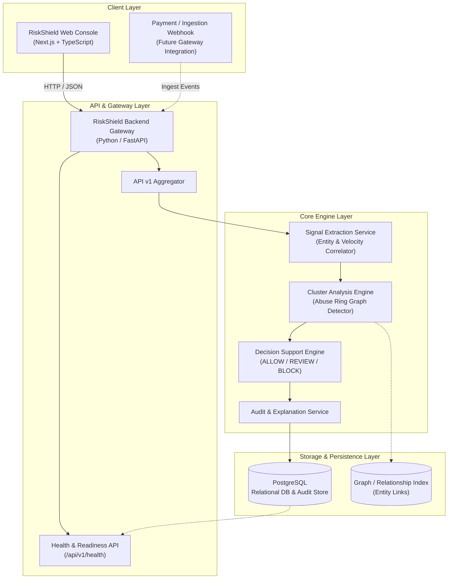

# RiskShield AI — System Architecture

This document describes the initial architectural design and component structure for **RiskShield AI (Abuse-Ring Sentinel)**.

---

## 1. System Vision & Purpose

RiskShield AI is a specialized intelligence and decision-support system designed to identify, analyze, and mitigate coordinated payment abuse. Organized fraud groups often distribute transactions across multiple synthetic accounts, rotating cards, IP addresses, and device fingerprints to evade per-account velocity limits.

RiskShield AI correlates these dispersed signals across transactions to isolate suspicious clusters and deliver actionable recommendations (`ALLOW`, `REVIEW`, `BLOCK`) with explainable evidence.

---

## 2. High-Level Architecture Diagram

---

## 3. Layered Design

### 3.1 Presentation Layer (Frontend)
- **Framework**: Next.js (App Router), React, TypeScript.
- **Role**: Operational console for risk analysts and compliance officers.
- **Responsibilities**:
  - Live system status and connectivity monitoring.
  - Visualization of flagged transaction clusters and risk scores (future phase).
  - Review workflows for analyst decision overrides (future phase).

### 3.2 Ingestion & API Layer (Backend)
- **Framework**: Python 3.11+, FastAPI, Pydantic v2.
- **Role**: Secure API gateway and request lifecycle orchestrator.
- **Responsibilities**:
  - Expose versioned REST endpoints (`/api/v1/*`).
  - System health checks (`/api/v1/health`) with runtime diagnostics.
  - Request validation and serialization via Pydantic.
  - CORS handling, configuration loading, and dependency injection.

### 3.3 Business Logic & Service Layer (Future Phases)
- **Signal Correlator**: Extracts behavioral, network, and instrument relationship signals.
- **Ring Sentinel / Clustering Engine**: Links transactions based on shared identities, cards, IPs, device tokens, and burst timing.
- **Decision Support Engine**: Computes normalized risk scores and determines recommendations:
  - `ALLOW` (Low Risk): No ring linkages, normal velocity.
  - `REVIEW` (Medium Risk / Borderline): Ambiguous signals requiring manual review.
  - `BLOCK` (High Risk): Strong ring indicators, multi-account device collusions, or high-risk entity overlap.
- **Audit Logger**: Immutably records every evaluation, confidence level, timestamp, and triggering signals.

### 3.4 Data & Persistence Layer
- **PostgreSQL**: Stores relational models, transaction entities, audit logs, and risk decisions.
- **Async Database Connection**: Managed through SQLAlchemy with connection pooling and async engine execution (`asyncpg`).

---

## 4. Core Signals Matrix

| Signal Category | Key Attributes Evaluated |
| :--- | :--- |
| **Identity & Account** | Customer ID, email domain patterns, account age, KYC status |
| **Device Fingerprint** | Device ID, canvas hash, browser user-agent, OS consistency |
| **Network & Location** | IP address, subnet cluster, proxy/VPN flag, ASN, geo-velocity |
| **Payment Instrument** | Card hash (BIN/last4), UPI VPA, billing address match, issuing bank |
| **Velocity & Frequency** | Bursts per minute/hour, sliding window transaction counts |
| **Amount & Pattern** | Structuring thresholds, round amounts, anomalous testing amounts |
| **State Sequence** | Repeated rapid authorization failures followed by successes |

---

## 5. Security & Architectural Guardrails

1. **Decision-Support Constraint**:
   - The platform is strictly an advisory and intelligence engine.
   - It cannot execute unilateral, irreversible fund transfers or direct payment settlements.
2. **Auditability by Design**:
   - Every risk recommendation is accompanied by an explanation payload detailing the exact signals that triggered the evaluation.
3. **Modularity & Decoupling**:
   - The database, API endpoints, schema validation, and future clustering logic are isolated into discrete modules to enable parallel scaling and clean extensibility.
